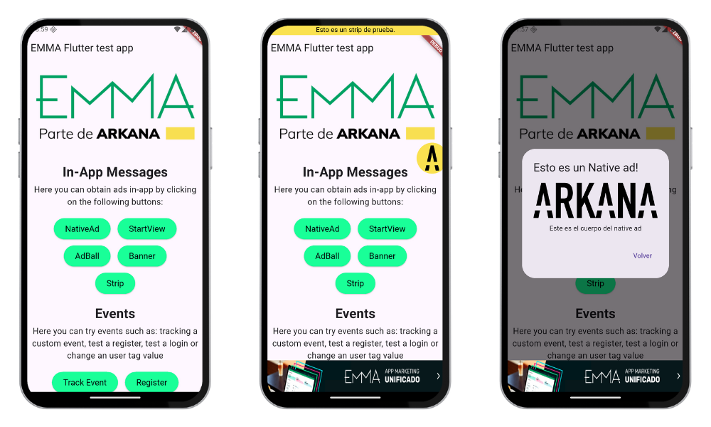

# 📱 App de prueba EMMA SDK (Flutter)

Este proyecto es una **app de pruebas** que estoy utilizando para **implementar y comprobar la integración del SDK de EMMA en Flutter**, framework para desarrollar apps híbridas. En este caso, **Android** e **iOS**. 

---

Capturas de pantalla:

## 📄 Documentación complementaria

Estoy documentando todo aquí:

👉 [**Guía de integración EMMA SDK en Flutter (Notion)**](https://www.notion.so/Integraci-n-b-sica-en-Flutter-23007100c6be801389b7ee5dbea2928e?source=copy_link)

## 🟢 Documentación oficial de EMMA

- [Documentación SDK Flutter oficial de EMMA](https://developer.emma.io/es/flutter/flutter_sdk)
- [Portal de documentación de EMMA](https://docs.emma.io/es/home)

